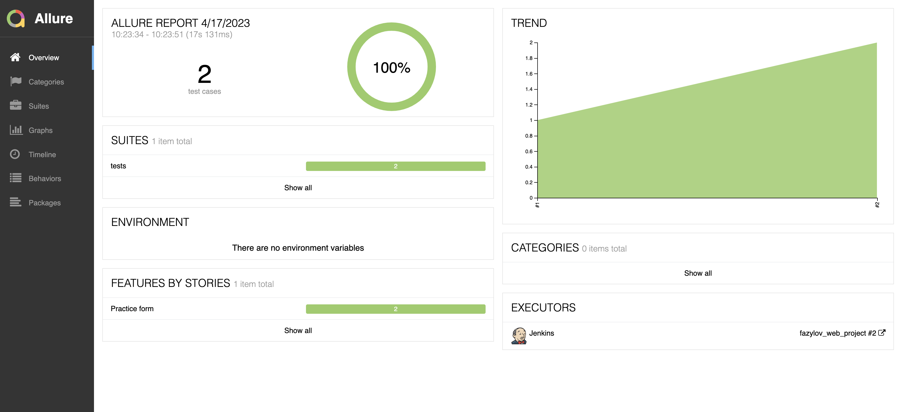

## Проект UI автотестов demoqa.com

<!-- Технологии -->

### Используемые технологии

  <code></code>
  <code></code>
  <code></code>
  <code></code>
  <code></code>
  <code></code>
  <code></code>
  <code></code>
  <code></code>

### Что проверяется в тестах:
#### Успешное заполнение формы:
- [x] Заполнение данных формы
- [x] Отправка заполненных данных
- [x] Проверка правильности заполненния данных
#### Заполнение формы без указания имени: 
- [x] Заполнение данных формы без указания формы
- [x] Отправка заполненных данных
- [x] Проверка того, что поле Name подвечено красным из-за отсутствия данных

<!-- Jenkins -->

###  Запуск проекта в Jenkins

### [Job](https://jenkins.autotests.cloud/job/fazylov_web_project/)

##### При нажатии на "Собрать сейчас" начинается сборка тестов и их прохождение

<!-- Allure report -->

###  Allure report

##### После прохождения тестов результаты автоматически сохраняются. Чтобы посмотреть Allure отчет, нужно нажать на иконку allure report у сборки.

##### Во вкладке Suites находятся подробные данные о прохождении теста с приложенными логами, скриншотами и видео о прохождении теста

##### Видео-прохождение теста

##### В канал в мессенджере telegram приходит краткая версия отчёта с ссылкой на полноценную версию в аллюре

